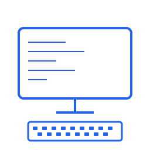

# 程序项目助手 (Program Assistant)

<div align="center">



**一个简洁高效的程序项目管理桌面应用**

[](LICENSE)
[](https://electronjs.org/)
[](https://vuejs.org/)
[](https://element-plus.org/)

[下载应用](#下载) • [功能特性](#功能特性) • [开发指南](#开发指南) • [贡献代码](#贡献)

</div>

## 📖 简介

程序项目助手是一个基于 Electron + Vue 3 + Element Plus 开发的桌面应用程序，专为开发者设计，用于管理和运行各种程序项目。它提供了直观的界面来组织、启动、监控和管理您的开发项目。

## ✨ 功能特性

### 🚀 核心功能
- **项目管理** - 添加、编辑、删除程序项目配置
- **一键运行** - 快速启动和停止程序
- **实时监控** - 查看程序运行状态和日志输出
- **批量操作** - 同时启动或停止多个程序
- **智能搜索** - 快速查找和筛选项目

### 💡 高级特性
- **多行命令支持** - 执行复杂的批处理脚本
- **独立日志窗口** - 每个程序都有专属的日志显示窗口
- **状态持久化** - 自动保存项目配置和状态
- **分类管理** - 按运行状态分类显示项目
- **现代化UI** - 基于Element Plus的美观界面

### 🎯 用户体验
- **无边框设计** - 现代化的窗口外观
- **响应式布局** - 适配不同屏幕尺寸
- **快捷操作** - 直观的按钮和交互设计
- **实时反馈** - 即时的状态更新和消息提示

## 📸 界面预览

### 主界面
- 清晰的项目列表展示
- 直观的运行状态指示
- 便捷的操作按钮组

### 日志窗口
- 实时的程序输出显示
- 彩色的日志分类
- 便捷的日志管理功能

## 🚀 快速开始

### 下载

#### 方式一：直接下载（推荐）
前往 [Releases](../../releases) 页面下载最新版本的可执行文件：
- `程序项目助手-1.0.0-DogeJian.exe` - Windows 便携版

#### 方式二：从源码构建
```bash
# 克隆仓库
git clone https://github.com/DogeJian/program-assistant.git
cd program-assistant

# 安装依赖
npm install

# 开发模式运行
npm run dev

# 构建应用
npm run electron:build
```

### 系统要求
- Windows 7 或更高版本
- x64 架构处理器
- 至少 200MB 可用磁盘空间

## 🛠️ 开发指南

### 技术栈
- **前端框架**: Vue 3 + Composition API
- **UI组件库**: Element Plus
- **桌面框架**: Electron
- **构建工具**: Vite
- **开发语言**: JavaScript

### 项目结构
```
program-assistant/
├── src/                    # 前端源码
│   ├── App.vue            # 主应用组件
│   └── main.js            # 应用入口
├── dist-electron/         # Electron主进程
│   ├── main.js            # 主进程入口
│   ├── preload.js         # 预加载脚本
│   ├── log-preload.js     # 日志窗口预加载
│   └── log.html           # 日志窗口页面
├── assets/                # 静态资源
│   └── icon.ico           # 应用图标
├── dist/                  # 构建输出
├── release/               # 打包输出
└── package.json           # 项目配置
```

### 开发命令
```bash
# 安装依赖
npm install

# 启动开发服务器
npm run dev

# 启动Electron开发模式
npm run electron:dev

# 构建前端
npm run build

# 打包应用
npm run electron:build

# 打包便携版
npm run electron:build-portable

# 打包安装程序
npm run electron:build-installer
```

### 开发环境配置
1. 确保安装了 Node.js 16+ 和 npm
2. 克隆项目并安装依赖
3. 运行 `npm run dev` 启动开发服务器
4. 在另一个终端运行 `npm run electron:dev` 启动Electron

## 🤝 贡献

欢迎贡献代码！请遵循以下步骤：

1. Fork 本仓库
2. 创建特性分支 (`git checkout -b feature/AmazingFeature`)
3. 提交更改 (`git commit -m 'Add some AmazingFeature'`)
4. 推送到分支 (`git push origin feature/AmazingFeature`)
5. 创建 Pull Request

### 贡献指南
- 遵循现有的代码风格
- 添加适当的注释和文档
- 确保新功能有相应的测试
- 提交前请测试所有功能

## 📝 更新日志

### v1.0.0 (2025-08-07)
- ✨ 初始版本发布
- 🎯 基础项目管理功能
- 🚀 程序运行控制
- 📊 实时日志显示
- 💻 多行命令支持
- 🎨 现代化UI设计

## 📄 许可证

本项目基于 [MIT](LICENSE) 许可证开源。

## 👨‍💻 作者

**DogeJian**

- GitHub: [@DogeJian](https://github.com/DogeJian)

## 🙏 致谢

- [Electron](https://electronjs.org/) - 跨平台桌面应用框架
- [Vue.js](https://vuejs.org/) - 渐进式JavaScript框架
- [Element Plus](https://element-plus.org/) - Vue 3 UI组件库
- [Vite](https://vitejs.dev/) - 下一代前端构建工具

## 📞 支持

如果您遇到问题或有建议，请：

1. 查看 [Issues](../../issues) 中是否有相似问题
2. 创建新的 [Issue](../../issues/new) 描述问题
3. 参与 [Discussions](../../discussions) 讨论

---

<div align="center">

**如果这个项目对您有帮助，请给个 ⭐ Star 支持一下！**

Made with ❤️ by DogeJian

</div>